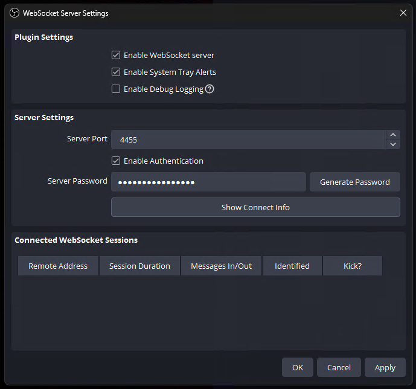
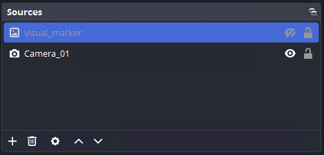
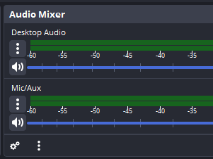

# Tobii Eye-Tracking Pipeline for Real-World Scenes

A Python toolkit for projecting Tobii Pro eye-tracker gaze data onto a **real-world scene** — not just a computer screen — using a homography transform. Built for behavioral and neuroscience research. Works in **non-head-fixed** conditions: the Tobii tracker actively compensates for head movement, so subjects can move naturally during recording.

> **Don't have a Tobii Pro device?** Check out our companion tool for camera-based gaze tracking using DeepLabCut:
> [gaze-to-scene-camera-mapper](https://github.com/nexflatline/gaze-to-scene-camera-mapper/)

---

## What Is This For?

Most eye-tracking software assumes the subject is looking at a computer screen. This pipeline goes further: it lets you map *where someone is looking* onto any real-world surface or scene, recorded by a separate scene camera. The subject does not need to look at a screen at all — and because the Tobii tracker also tracks head position, **subjects can move their heads naturally** during the recording without loss of accuracy.

### The core idea: homography

A **homography** is a mathematical mapping that relates the Tobii's calibrated coordinate system (tied to the calibration screen) to a scene camera's view of the same area. Once this mapping is computed from a short calibration recording, every gaze sample can be automatically projected to the correct location in your scene camera video — effectively answering the question *"what is the subject looking at in this scene?"* for every moment of the recording.

### Research examples

This approach is useful whenever the subject cannot or does not look at a computer screen, or when gaze across real-world objects needs to be measured. Examples include:

- **Social interaction:** Two people interact face-to-face. The eye tracker maps gaze onto the face and body of the interaction partner, allowing analysis of eye contact, face scanning patterns, and attention during live conversation.
- **Object preference in non-human primates:** A monkey is seated in front of a table with several food items or objects. Gaze is mapped onto the camera recording of the table, revealing which object attracted the animal's attention and for how long.
- **Infant visual attention:** An infant sits in front of a display board with pictures or toys. Gaze is projected onto the scene video to analyze which stimuli the infant fixated, without requiring them to interact with a screen.
- **Control panel monitoring:** A human operator monitors a physical instrument panel. Gaze data is projected onto the panel recording to reveal inspection patterns and missed areas.
- **Display and poster inspection:** A participant views a printed questionnaire, a stimulus array, or a physical display. Gaze can be overlaid on the scene recording without requiring stimuli to be on a screen.

---

## Hardware Requirements

- A **Tobii Pro eye tracker** connected to the computer via USB.
  This software was developed and confirmed working with the **Tobii Pro Nano**.
- A **scene camera** (any standard webcam or camera) recording the area the subject is looking at.
- A **calibration screen** (a laptop or monitor) that can be temporarily placed in the subject's gaze area during calibration — see [Calibration Setup](#calibration-setup) below.

---

## Platform Support

| Platform | Status |
|----------|--------|
| Windows 10 / 11 | ✔ Confirmed working |
| macOS | ✔ Confirmed working |
| Linux | May work if the Tobii Pro driver is correctly set up (can be difficult; not officially tested) |

---

## ⚠️ Important Notice: Tobii Pro SDK

> **This software requires the Tobii Pro SDK, which is proprietary software owned by Tobii AB and is NOT included in this repository.**
>
> By downloading and installing the Tobii Pro SDK, you accept Tobii AB's license terms. You are solely responsible for complying with those terms.
>
> This project is not affiliated with, endorsed by, or sponsored by Tobii AB.

See [Installing the Tobii Pro SDK](#4-install-the-tobii-pro-sdk) below.

---

## Calibration Setup

Before using the pipeline, it is important to understand how the scene calibration works and how to set up your equipment.

### How it works

The Tobii eye tracker is first calibrated to a computer screen using the standard Tobii calibration procedure (Step 1 below). This tells the tracker where on the screen the subject is looking, expressed as normalized coordinates (0 to 1 across the screen).

To project that gaze onto your real-world scene, you need two things:

1. A **calibration recording**: a short video made with the scene camera **while the calibration screen is placed in the gaze target area**. The scene camera must record this calibration screen showing the calibration dots — this recording is essential to compute the homography.
2. A **homography computation**: using this video, you click on each calibration point location in the scene camera's view. The software then computes the geometric mapping between the tracker's screen coordinates and the camera's perspective of the scene.

Once the homography is saved, it can be applied to any future recording session, as long as the camera position has not changed.

### Positioning the calibration screen

```
      [Scene Camera] ← must record this whole setup
           |
           | (recording)
           ↓
  ┌────────────────────┐  ← Gaze target area
  │   [Cal. Screen]    │     (e.g., table, partner's face location)
  │  showing cal. dots │
  └────────────────────┘
          ↑
     Subject sits here
     wearing eye tracker
     (head can move freely)
```

- The calibration screen should be **placed on or very close to the gaze target surface**, covering as much of it as possible. A larger screen relative to the target area gives better accuracy across the whole region.
- **The subject's head can move freely during recording.** The Tobii tracker compensates for head movement in real time, so subjects do not need to keep their head fixed.
- The **scene camera must not move** after the calibration recording is made, as the homography is specific to the camera's exact position and angle.
- The **relative position between the eye tracker mount and the scene** is what must stay constant. If the tracker's position or angle changes significantly (e.g., it falls off, or the mounting arm shifts), a new calibration is needed.

### Example: social interaction setup

For a **face-to-face social interaction** task where Subject A's gaze toward a partner (Subject B) needs to be tracked:

1. Have Subject A sit in their normal position wearing the eye tracker.
2. **Before the experiment**, place a **lightweight portable USB display** (or any small screen) at the position where Subject B's head/face will be during the interaction. Position it at the same distance and angle as the real partner's face will be.
3. Run the Tobii calibration (Step 1) with Subject A looking at the calibration dots on this portable screen.
4. Start the scene camera recording, and briefly show the calibration dots on the portable screen while the camera records — this is your calibration video for the homography.
5. **Remove the portable screen.** Subject B can now take their seat in the natural position.
6. Run the experiment as normal. The gaze data recorded during the session will map accurately onto Subject B's face in the scene camera video.

### Reusing calibrations

As long as the scene camera does not move, **the scene calibration can be saved and reused across multiple sessions and multiple subjects**, without needing to repeat the calibration video. This is especially convenient in:

- **Infant research**, where calibration can take time and cooperation is limited.
- **Non-human primate research**, where repeated calibration is difficult and stressful for the animal.
- **Social interaction paradigms**, where the scene layout is fixed and consistent across participants.

Note that the Tobii tracker calibration (Step 1) is subject-specific and should be re-run for each new subject or whenever the tracker's position on the mounting changes. The scene calibration (Step 3) only needs to be redone if the scene camera moves.

---

## Installation

### 1. Install Conda (Recommended)

We strongly recommend using a **Conda** environment to manage dependencies cleanly. We recommend **Miniforge**, a lightweight alternative to Anaconda:

- Download Miniforge: https://github.com/conda-forge/miniforge
- Alternatively, use Miniconda (https://docs.conda.io/en/latest/miniconda.html) or Anaconda (https://www.anaconda.com/).

Official Conda documentation: https://docs.conda.io/projects/conda/en/latest/user-guide/getting-started.html

### 2. Create and activate the environment

Open a terminal:
- **Windows:** Open **Anaconda Prompt** (or the **Miniforge Prompt**) from the Start menu.
- **macOS:** Open **Terminal** from Applications → Utilities.

Run these commands one by one:

```bash
# Create a new environment named 'eyetracking' with Python 3.10
conda create --name eyetracking python=3.10

# Activate the environment
conda activate eyetracking
```

> You must activate the environment every time you open a new terminal before running the scripts.

### 3. Get the code

```bash
git clone https://github.com/nexflatline/gaze-mapper-for-tobii-eyetrackers.git
cd gaze-mapper-for-tobii-eyetrackers
```

Or download and extract the ZIP from the GitHub page (green **Code** button → **Download ZIP**), then open a terminal inside the extracted folder.

### 4. Install the Tobii Pro SDK

The Tobii Pro SDK provides the Python interface to communicate with the eye tracker. It is **not included in this repository** and must be installed separately.

**Step 4a — Install the Tobii Pro runtime software**

Download and install the **Tobii Pro Eye Tracker Manager** from Tobii's website. This installs the low-level driver and runtime that the Python SDK depends on:

- https://www.tobiipro.com/product-listing/tobii-pro-eye-tracker-manager/

After installation, open Eye Tracker Manager and confirm your device is detected before continuing.

**Step 4b — Install the Python SDK package**

With your conda environment active, run:

```bash
pip install tobii-research
```

This installs the `tobii_research` Python package from PyPI, which is Tobii's official Python binding.

> If the `pip install` command fails or the tracker is not found at runtime, visit Tobii's developer pages for platform-specific troubleshooting:
> https://developer.tobiipro.com/python/python-getting-started.html

### 5. Install the remaining Python dependencies

```bash
pip install numpy opencv-python Pillow sounddevice obs-websocket-py
```

Or, from the project folder:

```bash
pip install -r requirements.txt
```

---

## Workflow Overview

The pipeline has three steps. You run them in order for each experiment:

```
Step 1 ─ calibrate_eyetracker.py
          Calibrates the Tobii tracker to the screen.
          Saves: tobii_calibration.pkl
          Re-run: when the subject, screen, or tracker position changes.

Step 2 ─ record_gaze_OBS.py
          Records gaze data during the experiment session.
          Saves: gaze_recording_YYYYMMDD_HHMMSS.csv
          Run once per session.

Step 3 ─ scene_camera_calibration.py  (post-processing)
          Maps gaze onto the scene camera video using homography.
          Saves: scene_calib_*.pkl, *_scene_camera.csv, gaze_overlay.mp4
          Re-run only if the camera position changes.
```

---

## Step-by-Step Usage

### Step 1 — Calibrate the Eye Tracker

This calibrates the Tobii tracker to your calibration screen. **Run this before any new recording session, or when the eye tracker or screen position changes.**

**How to run:**

```bash
# Make sure the eyetracking environment is active first
conda activate eyetracking

# Navigate to the project folder
cd path/to/this/folder

# Run the calibration script
python calibrate_eyetracker.py
```

**What you will see:**

A setup window appears with two areas:
- **Left side:** Options to choose the number of calibration points (5 or 9) and optionally select a custom GIF as the fixation target.
- **Right side:** A **real-time headbox guide** showing where your head is relative to the tracker. A colored circle indicates your position:
  - 🔴 **Red** — head is outside the tracking range, move closer to the center.
  - 🟡 **Yellow** — head is within acceptable range.
  - 🟢 **Green** — head is in the optimal position. This is when to start calibration.

**Calibration sequence:**

1. Position your head so the indicator is **green** on the headbox guide.
2. Click **"Start Calibration"**.
3. The screen will go fullscreen and show a white dot (or your custom GIF) at each calibration point.
4. **Look at the dot** and press **Enter** to record data for that point.
5. Use **← →** arrow keys to go back or skip forward if needed.
6. After all points are recorded, a **results screen** appears showing dots near each target:
   - **Green dots** = left eye gaze samples (valid)
   - **Blue dots** = right eye gaze samples (valid)
   - **Red dots** = invalid samples
7. **Click on any target point** to re-calibrate just that point if needed.
8. Press **Escape** to save and exit.

The file `tobii_calibration.pkl` is saved in the same folder.

| Key | Action |
|-----|--------|
| Enter | Record gaze data for the current point |
| ← → | Navigate to previous / next point |
| Escape | Finish calibration and save |

> **Tip:** Use 9 points for higher accuracy, especially when the gaze target area is large. 5 points are faster and sufficient for simpler setups.

---

### Step 2 — Record Gaze Data

Run this during the experiment session. **Start OBS recording first** (if you are using a scene camera), then run this script.

**How to run:**

```bash
conda activate eyetracking
cd path/to/this/folder
python record_gaze_OBS.py
```

On first run, if `obs_config.txt` is missing, the script creates it with default OBS settings and continues. Edit that file if you use OBS (password, scene name, audio source). If you are not using OBS, you can leave the defaults — recording still works, without OBS sync.

**What happens:**

1. The script automatically loads `tobii_calibration.pkl` from Step 1.
   - If the file is not found, a dialog will ask you to browse for it.
2. A **fullscreen black window** opens, showing a circle that follows the subject's gaze in real time:
   - **Green circle** = both eyes are being tracked.
   - **Yellow circle** = only one eye is tracked (still records data).
   - No circle = gaze not detected.
3. At the start of recording, a **sync tone sequence** plays through the speakers. This tone is recorded by OBS and will be used later to align gaze data to the scene video.
4. Gaze data is continuously saved to a CSV file (e.g., `gaze_recording_20260413_143022.csv`).

**Stopping the recording:**

Press **Escape** or **Alt+Q** to stop. An **END sync tone** plays, then the script saves and exits cleanly.

| Key | Action |
|-----|--------|
| Escape or Alt+Q (Option+Q on macOS) | Stop recording and save |
| Alt+M (Option+M on macOS) | Minimize the window temporarily |

> **Important:** Do not close the window by clicking the X — use the keyboard shortcut to ensure the data is saved properly.

---

### Step 3 — Scene Camera Calibration and Gaze Export

This is a post-processing tool. After the experiment, use it to:
1. Compute the homography between the Tobii screen coordinates and your scene camera.
2. Align gaze data timing with the scene camera video.
3. Export the results as a video with a gaze overlay, or as a CSV with scene coordinates.

**How to run:**

```bash
conda activate eyetracking
cd path/to/this/folder
python scene_camera_calibration.py
```

**If this is your first time, click "First Time User Tutorial"** in the top-right panel. It will guide you through every step interactively.

#### Sub-step 3A: Calibrate the scene camera (homography)

> Skip this if you already have a saved scene calibration file (`.pkl`) from a previous session and the camera has not moved.

You need a **calibration video**: a recording made with the scene camera while the calibration screen was placed in the gaze target area, showing the same calibration dots that were used in Step 1.

1. Click **"1. Calibrate Scene Camera"**.
2. Load the calibration video when prompted.
3. Load `tobii_calibration.pkl` when prompted.
4. The program will ask you to click on each calibration point in the video, in order. Use the video slider to find frames where the dots are clearly visible.
   - Hover over a point in the video to preview the click location.
   - Click to confirm the location of each point.
5. When all points are clicked, you will be prompted to save the scene calibration file (`.pkl`). **Save this file** — you can reuse it for all future sessions as long as the camera position does not change.

#### Sub-step 3B: Synchronize gaze data with the video

1. Click **"2. Synchronize & Process"**.
2. Load the **experiment video** (not the calibration video).
3. Load `tobii_calibration.pkl`, the scene calibration file, and the gaze CSV from Step 2.
4. Use the slider or arrow buttons to scrub through the video until you find the **exact frame where the START sync tone occurred** (you will see this on the audio waveform if you use video editing software, or listen for the tone).
5. Click **"Set Sync Frame (Current)"** to mark that frame.

#### Sub-step 3C: Generate outputs

- **"Generate Gaze Video"** — creates an `.mp4` video with a red circle overlaid at the gaze position for each frame.
- **"Export Converted CSV"** — creates a `.csv` file with the original gaze data plus additional columns `scene_left_x`, `scene_left_y`, `scene_right_x`, `scene_right_y` giving gaze in scene camera pixel coordinates (normalized 0–1).

---

## OBS Setup (Strongly Recommended for Scene Camera Sync)

OBS Studio is a free recording application used to record the scene camera. Synchronizing the gaze data timeline with the scene video is one of the most critical steps in this pipeline, and OBS makes it significantly easier by embedding both a **visual flash marker** and an **audio sync tone** directly into the scene recording at the moment recording starts and ends. This eliminates guesswork when aligning the two data streams in post-processing.

**OBS is strongly recommended** unless you already have a dedicated hardware synchronization method (e.g., TTL pulses, a shared external clock signal, or a sync light recorded on camera). If you record the scene camera with a different application or a standalone camera without any sync signal, aligning gaze data to the video will require manual frame-by-frame estimation, which is error-prone.

The audio sync tone alone (played through the speakers and captured by OBS) is often sufficient for sub-frame accuracy alignment even without the visual marker.

### Install OBS

Download from https://obsproject.com/

### Enable the WebSocket server in OBS

1. In OBS, go to **Tools → WebSocket Server Settings**.
2. In the settings window:
   - Check **"Enable WebSocket Server"**
   - Check **"Enable System Tray Alerts"**
   - Set **Server Port** to `4455`
   - Check **"Enable Authentication"** and set a password — note it down, you will need it for `obs_config.txt`



### Create the visual sync marker source

In the OBS **Sources** panel:
1. Click **+** and select **"Image"** as the source type.
2. Choose **"Create new"** and name it exactly `visual_marker`.
3. Select any image file to use as the marker (e.g., a bright colored square or any visible graphic).
4. Make it **invisible** by clicking the **eye icon** next to it in the Sources list — the script will show and hide it automatically during recording.



### Check the audio source name

In the OBS **Audio Mixer** panel, note the exact name of your main audio output source. You will need to enter this name in `obs_config.txt`.



### Configure `obs_config.txt`

1. Copy `obs_config.example.txt` to a new file named `obs_config.txt` in the same folder.
2. Edit it to match your OBS settings:

```
OBS_HOST=localhost
OBS_PORT=4455
OBS_PASSWORD=your_password_here
OBS_SCENE_NAME=Scene
OBS_VISUAL_SOURCE=visual_marker
OBS_AUDIO_SOURCE=Desktop Audio
```

- `OBS_AUDIO_SOURCE` must match **exactly** the name shown in your OBS Audio Mixer (e.g., `Desktop Audio` on Windows, or your device name on macOS).

> **Security:** `obs_config.txt` is listed in `.gitignore` and will never be uploaded to GitHub, because it contains your password.

### Recording procedure with OBS

1. Start OBS and begin recording the scene **first**.
2. Then run `record_gaze_OBS.py`.
3. The START sync tone plays through the speakers and is captured by OBS. The `visual_marker` source will flash briefly on the OBS recording.
4. When done, stop `record_gaze_OBS.py` first (the END marker is recorded), then stop OBS.

---

## Output Files

| File | Created by | Description |
|------|-----------|-------------|
| `tobii_calibration.pkl` | Step 1 | Eye tracker calibration data (screen + tracker geometry) |
| `gaze_recording_YYYYMMDD_HHMMSS.csv` | Step 2 | Raw gaze data with timestamps |
| `scene_calib_*.pkl` | Step 3 | Scene camera homography calibration (reusable) |
| `*_scene_camera.csv` | Step 3 | Gaze data with scene camera coordinates added |
| `gaze_overlay_*.mp4` | Step 3 | Scene video with gaze cursor overlaid |

---

## Gaze CSV Format (Step 2 output)

| Column | Description |
|--------|-------------|
| `timestamp_system` | Unix timestamp in seconds |
| `timestamp_ms` | Milliseconds since recording start |
| `left_x`, `left_y` | Left eye gaze position (0–1, normalized screen coordinates) |
| `right_x`, `right_y` | Right eye gaze position (0–1, normalized screen coordinates) |
| `left_pupil`, `right_pupil` | Pupil diameter in millimeters |
| `left_validity`, `right_validity` | 1 = valid sample, 0 = invalid/not detected |
| `left_gaze_origin_x/y/z` | Left eye 3D position relative to tracker (mm) |
| `right_gaze_origin_x/y/z` | Right eye 3D position relative to tracker (mm) |
| `left_gaze_point_3d_x/y/z` | Left eye 3D gaze point in space (mm) |
| `right_gaze_point_3d_x/y/z` | Right eye 3D gaze point in space (mm) |
| `sync_marker` | Empty on gaze rows; `visual_marker_START` or `visual_marker_END` on sync events |

---

## Troubleshooting

**"No eye trackers found" when starting a script**
- Make sure the Tobii device is connected via USB and powered on.
- Open Tobii Pro Eye Tracker Manager and confirm the device appears there first.
- Check that the Tobii Pro SDK is installed: `pip install tobii-research` (in the active environment).

**"Tobii Research SDK not found" error at startup**
- The `tobii-research` Python package is not installed in the current environment.
- Activate the correct environment first: `conda activate eyetracking`
- Then run: `pip install tobii-research`

**Calibration accuracy is poor**
- Make sure the subject's head was in the green zone on the headbox guide before starting.
- Try 9 calibration points instead of 5.
- Keep the subject's head still during each collection. Only press Enter once the subject is clearly looking at the dot.
- Use the re-calibration feature (click any point on the results screen) to fix individual problem points.

**OBS not connecting (no sync)**
- The recording will still work — sync tones play through the speakers regardless.
- Check that OBS is running and the WebSocket server is enabled under Tools → WebSocket Server Settings.
- Make sure `obs_config.txt` exists and the password matches OBS.

**Audio sync tone not playing**
- Make sure your system audio output is not muted.
- On macOS, check that the correct output device is selected in System Settings → Sound.
- On Windows, the script uses a low-latency audio mode automatically.

**Scene calibration is inaccurate / gaze is offset in the video**
- Make sure you clicked the calibration points in the correct order (matching the order used during the Tobii calibration).
- Use more calibration points (the Tobii tracker supports up to 9 points — more points give a better homography).
- Make sure the calibration screen covered as much of the gaze target area as possible. A calibration screen that is much smaller than the target area will extrapolate poorly near the edges.
- Verify the scene camera has not moved since the calibration video was recorded.
- **Understanding homography limitations:** The homography is a 2D projection — it maps a flat calibration screen to the scene camera's view of approximately the same flat area. Because the scene camera and the subject's eye tracker have different physical viewpoints, some geometric distortion is unavoidable, especially if the gaze target area is not flat (e.g., a curved surface or a 3D object like a face). The closer the calibration screen was placed to the actual gaze target plane — both in position and angle — the smaller this error will be. For example, in a social interaction task, placing the calibration screen at the exact position and distance of the partner's face minimizes the offset when gaze is later projected onto the partner's face in the video.

**On Linux: tracker not detected**
- Tobii's Linux support is limited. See the Tobii developer community for guidance on setting up the Tobii Pro SDK on Linux: https://developer.tobiipro.com/

---

## Windows: Desktop Shortcut for Quick Launch

To avoid opening a terminal every time, you can create a Windows shortcut that automatically opens the correct Conda environment and navigates to the project folder.

### Find your Conda path

Look for the file `conda-hook.ps1` inside your Conda installation. Common locations:

- `C:\Users\YourName\miniforge3\shell\condabin\conda-hook.ps1`
- `C:\Users\YourName\anaconda3\shell\condabin\conda-hook.ps1`
- `C:\Users\YourName\miniconda3\shell\condabin\conda-hook.ps1`

### Create a shortcut

1. Right-click on your Desktop → **New → Shortcut**.
2. Paste this into the "Type the location" field (replace the two paths with your own):

```
C:\Windows\System32\WindowsPowerShell\v1.0\powershell.exe -ExecutionPolicy ByPass -NoExit -Command "& '[YOUR_CONDA_PATH]' ; conda activate eyetracking ; cd '[YOUR_PROJECT_PATH]'"
```

Use double backslashes (`\\`) in both paths. Replace `[YOUR_CONDA_PATH]` with the full path to `conda-hook.ps1`, and `[YOUR_PROJECT_PATH]` with the folder that contains these scripts.

3. Click **Next**, give it a name (e.g., `Start EyeTracking Prompt`), then **Finish**.

### Shortcuts that launch a specific script directly

To launch the calibration automatically:
```
C:\Windows\System32\WindowsPowerShell\v1.0\powershell.exe -ExecutionPolicy ByPass -NoExit -Command "& '[YOUR_CONDA_PATH]' ; conda activate eyetracking ; cd '[YOUR_PROJECT_PATH]' ; python calibrate_eyetracker.py"
```

To launch the gaze recorder:
```
C:\Windows\System32\WindowsPowerShell\v1.0\powershell.exe -ExecutionPolicy ByPass -NoExit -Command "& '[YOUR_CONDA_PATH]' ; conda activate eyetracking ; cd '[YOUR_PROJECT_PATH]' ; python record_gaze_OBS.py"
```

---

## Author

Rafael Bretas  
Center for Information and Neural Networks (CiNet), National Institute of Information and Communications Technology (NICT)

---

## Acknowledgments

Special thanks to Dr. Kazuki Enomoto (Center for Information and Neural Networks) for providing testing and validation data and for his help with testing the software.

This material is based upon work supported by the JSPS KAKENHI Grant Number JP25K10619.

---

## Citation

If you use this software in a publication, please consider citing the repository:

```
Bretas, R. (2026). Tobii Eye-Tracking Pipeline for Real-World Scenes [Software].
National Institute of Information and Communications Technology (NICT).
https://github.com/nexflatline/gaze-mapper-for-tobii-eyetrackers
```

---

## License

Copyright (c) 2026 National Institute of Information and Communications Technology (NICT)

This project is released under the **MIT License**. See [LICENSE](LICENSE) for details. You are free to use, modify, and redistribute it with attribution.

The **Tobii Pro SDK** (`tobii-research` package and associated runtime) is proprietary software owned by Tobii AB and is governed by Tobii's own license agreement. It is not covered by the MIT license of this project. By installing and using the Tobii Pro SDK you agree to Tobii AB's terms.
